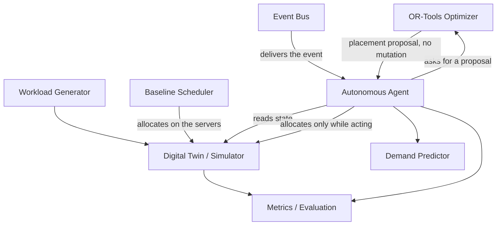
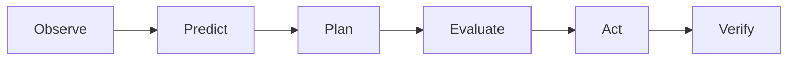

# Autonomous Data Center Digital Twin

## Overview

This project is a software digital twin of a small data center and a closed-loop controller for two decisions: where a new workload should run, and how to restore workloads after a server fails.

The twin tracks CPU and memory capacity. Placement is a constrained assignment problem. A one-step demand predictor can raise the CPU used for planning. An OR-Tools solver proposes a feasible placement. An in-process event bus delivers facts, and an autonomous agent turns those facts into a checked action. Fixed seeds make the scenarios reproducible.

This is a simulation used to study that control loop. It does not operate a real data center.

## Problem

A workload needs a certain amount of CPU and memory. A server has a fixed capacity for both, and it can be taken out of service. New workloads arrive after the initial placement. A server failure makes the workloads on that machine need a new host, while workloads on the other servers stay where they are.

Those constraints compete. Spreading load lowers the busiest server, but a workload that fits nowhere must be left unplaced rather than forced onto a machine. After a failure, the same demand has to fit on fewer operational servers. The controller has to notice the event, propose a placement that respects capacity, apply it only when the proposal is valid, and show a clear failure when it is not.

## Architecture



The optimizer decides a constrained assignment. The agent decides whether that assignment is applied.

The control loop is:



Prediction runs while the agent is observing. The recorded states do not include a separate predicting step.

## Core Components

### Digital Twin

`Server`, `Rack`, `Workload`, and `DataCenter` hold identity, capacity, and the workloads currently assigned to a server. Used CPU and memory are derived from those assignments.

`SimulationEngine` advances a tick and updates power and temperature from utilization. Operational power is idle power plus utilization times the span from idle to max power. An inactive server contributes no power. Temperature moves by a heat term proportional to CPU utilization and a cooling term from the rack. The formulas are linear and simplified. They are not a facility energy model.

### Baseline Scheduler

`BaselineScheduler` walks workloads in input order. For each one it chooses the operational server that can host it and currently has the lowest CPU utilization. A tie goes to the earlier server in the input list. It calls `Server.allocate`, so it does change server state. A workload that fits nowhere is recorded as unplaced instead of raising. This greedy pass is the control group for the optimizer.

### Constraint Optimizer

`PlacementOptimizer` builds a CP-SAT model:

- a binary variable for each workload-server pair
- at most one server per workload
- CPU and memory limits, with demand rounded up and capacity rounded down
- existing assignments reserved on each server
- inactive servers forbidden as targets
- a rejection penalty larger than any peak, so a feasible workload is placed before the solver chases a lower peak
- an objective that then minimizes peak CPU utilization, with a server-index tie-break

The result is a proposal: a map of workload id to server id, plus any unplaced ids. The optimizer does not call `Server.allocate` and does not change the data center.

### Demand Predictor

`DemandPredictor` fits scikit-learn `LinearRegression` on a sliding window of CPU observations and predicts the next value. Planning CPU is `max(current CPU, predicted CPU)` on a new workload object. `Workload.cpu_required` is left unchanged.

Histories in the experiments are synthetic, including exact lines. The predictor is there to show how a forecast can change a placement. It is not a production demand forecast.

### Event System

`Event` is a fact at a tick. `EventBus` is an in-process list of handlers. Publishing appends the event, then calls subscribers in subscription order. A handler exception propagates. There is no queue or broker.

Defined event types:

- workload arrival
- demand change
- server failure
- server recovery
- resource threshold breach

The agent subscribes to workload arrival and server failure. The other three types can be published, and nothing in the agent handles them yet.

### Autonomous Agent

`AutonomousAgent` takes the data center, predictor, and optimizer in its constructor. States are `IDLE`, `OBSERVING`, `PLANNING`, `EVALUATING`, `ACTING`, `VERIFYING`, `COMPLETED`, and `FAILED`.

For a workload arrival the recorded sequence is:

`IDLE → OBSERVING → PLANNING → EVALUATING → ACTING → VERIFYING → COMPLETED`

While observing, the agent reads the workload and, when the history is long enough, forecasts the next CPU. Planning asks the optimizer for a placement of `max(current, predicted)` CPU on a copy of the servers. Evaluation checks that proposal on another copy, including a simulation tick on that copy. Only acting calls `Server.allocate` on the real server, and it allocates the original workload so the current CPU is unchanged. Verification checks that the workload is on the chosen server and that capacity still holds. An invalid plan ends in `FAILED` and leaves the real data center unchanged. If verification fails after allocate, the workload is released.

For server failure the same states are used. The agent lists the workloads on the named server, plans only onto the other operational servers, and evaluates that proposal on copied state. The failed server is excluded from the planning copy. If every affected workload can be placed, acting removes them from the failed server, allocates them to the selected servers, and then marks that server `INACTIVE`. If any affected workload cannot be placed, the agent raises, records `FAILED`, and does not move anything. If acting or verification fails after a move has started, the moved workloads are put back. Recovery is all-or-nothing. Unaffected workloads are not migrated.

## Why This Is an Autonomous Agent

The autonomy is the closed loop, not a language model. There is no LLM in this repository.

On an event the agent:

1. receives the event from the bus
2. observes the current data-center state
3. predicts the next CPU when enough history exists, and otherwise uses the current CPU
4. asks the optimizer for a capacity-feasible plan
5. evaluates that plan on a copy
6. executes the plan on the real servers only after that check
7. verifies the resulting assignment and capacity
8. stops in `FAILED`, or rolls a partial move back, when the plan cannot be completed

Given the same data center, event, and dependencies, the decision is deterministic.

## Experiments and Results

These figures come from the scripts in `scripts/`. Each is one controlled run, not a general performance result.

### Baseline vs Optimizer

`scripts/compare_baseline_optimizer.py` uses seed 42: 6 workloads (CPU 1–4, memory 1–8) and 3 servers (CPU capacity 20, memory capacity 40), then 5 simulation ticks on each fresh data center.

| Measure | Baseline | Optimizer |
| --- | --- | --- |
| Peak CPU utilization | 0.3097 | 0.2269 |
| Total CPU utilization | 0.2138 | 0.2138 |
| Memory utilization | 0.1527 | 0.1527 |
| Total power | 428.3067 | 428.3067 |
| Average temperature | 20.3461 | 20.3461 |
| Solver status | — | OPTIMAL |
| Rejections | — | 0 |

In this scenario the optimizer reduced the busiest server's CPU share. Total CPU demand was the same, and every workload was placed, so the linear power and temperature model produced the same totals. That is not an energy saving, and it is not a claim about other scenarios.

### Predictive Planning

`scripts/run_demand_prediction_experiment.py` builds three synthetic CPU series, freezes a placement under current demand and another under `max(current, predicted)`, then scores both with the next held-out tick.

| Plan | Future realized peak CPU |
| --- | --- |
| Current-demand planning | 0.5500 |
| Prediction-aware planning | 0.5250 |

The series are exact lines, so the linear model can recover them. The lower future peak shows that the forecast changed the packing in this scenario. It does not measure forecast accuracy on real demand.

### Server Failure Recovery

`scripts/run_system_evaluation.py` runs seeds 1 through 5. Each seed generates 8 workloads (CPU 1–4, memory 1–8) onto 4 servers (CPU capacity 20, memory capacity 40), places them with the optimizer, then fails the operational server that holds the most workloads.

| Result | Value |
| --- | --- |
| Scenarios | 5 |
| Successful recoveries | 5 |
| Failed recoveries | 0 |
| Affected workloads | 12 |
| Recovered workloads | 12 |
| Unrecovered workloads | 0 |
| Constraint violations | 0 |

Peak CPU rose after each failure. Examples: seed 1 went from 0.2366 to 0.3901, and seed 2 from 0.3713 to 0.4893. The same demand was left on 3 operational servers instead of 4. That is a consequence of the failure, not a performance improvement. This configuration had enough spare capacity for every affected workload. A tighter data center can reject recovery. The unit tests cover that case.

## Testing

```
Ran 94 tests in the last full run.
OK
```

`unittest` covers the server model, the simulator, workload generation, the baseline scheduler, metrics, the placement optimizer, the demand predictor, the event bus, workload arrival, and server-failure recovery. No coverage percentage has been measured.

## Reproducibility

`WorkloadGenerator` uses its own `random.Random` seeded by the caller. The optimizer uses one CP-SAT worker and a fixed solver seed. The evaluation script uses the fixed seed list `[1, 2, 3, 4, 5]` and the same data-center size for every seed.

The same code and the same configuration reproduce the same scenario. A later change to the scheduler, the objective, or the scenario size can change the numbers. Reproducibility is not a promise that the results are frozen forever.

## Project Structure

```
src/
  models/        Workload, Server, Rack, DataCenter
  simulator/     engine, config, workload generator, metrics
  scheduler/     baseline scheduler
  optimizer/     OR-Tools placement optimizer
  predictor/     demand predictor and planning workloads
  agent/         events, event bus, autonomous agent
tests/           unittest modules for those packages
scripts/         deterministic experiment scripts
requirements.txt ortools and scikit-learn
```

## How to Run

From the repository root in Windows PowerShell:

```powershell
$env:PYTHONPATH = "src"
python -m unittest discover -s tests -v
```

The experiment scripts insert `src` onto `sys.path` themselves. With `PYTHONPATH` set as above, these commands run the main checks:

```powershell
python scripts/compare_baseline_optimizer.py
python scripts/run_demand_prediction_experiment.py
python scripts/run_failure_recovery_experiment.py
python scripts/run_system_evaluation.py
```

Other scripts in `scripts/` walk a single simulation, generated workloads, the baseline scheduler, or one workload-arrival decision. They are demonstrations of those pieces, not extra benchmarks.

Install dependencies with `pip install -r requirements.txt` before the optimizer or predictor tests.

## Design Decisions / Tradeoffs

- The greedy scheduler is the baseline. It is easy to explain and it mutates servers as it goes, which makes the optimizer's proposal-only result a clear contrast.
- Placement is a discrete assignment with capacity limits, so the solver is CP-SAT rather than a continuous optimizer.
- Seeds and a single solver worker keep experiments repeatable.
- The simulator updates power and temperature. It does not choose placements.
- The optimizer returns a proposal. `Server.allocate` runs only in the agent's acting step, or inside the baseline scheduler.
- Planning and evaluation use copied servers. The real data center changes only if the proposal passes.
- The agent is a deterministic state machine. An LLM is not required to close the loop.

## Limitations and Future Work

- Power and temperature are linear functions of utilization and rack cooling. They do not model a real cooling plant.
- Workloads and CPU histories are synthetic.
- The predictor is one-step linear regression.
- The five-seed evaluation uses one data-center size and one failure rule. It does not explore partial capacity loss, correlated failures, or recovery of a server that comes back.
- The event bus is in-process and synchronous. Demand change, server recovery, and threshold breach are defined and not handled.
- The scale is a handful of servers and workloads.
- Nothing here calls a cloud API or actuates hardware.

Later work could use recorded workload traces, a less linear thermal and power model, a broker instead of the in-process bus, a larger simulated fleet, migration cost, latency or SLA limits, more failure modes, and a connection to real infrastructure. None of that is in this version.

## Technologies

- Python, tested on 3.12
- OR-Tools CP-SAT (`ortools`)
- scikit-learn linear regression
- `unittest` from the standard library
- Git
